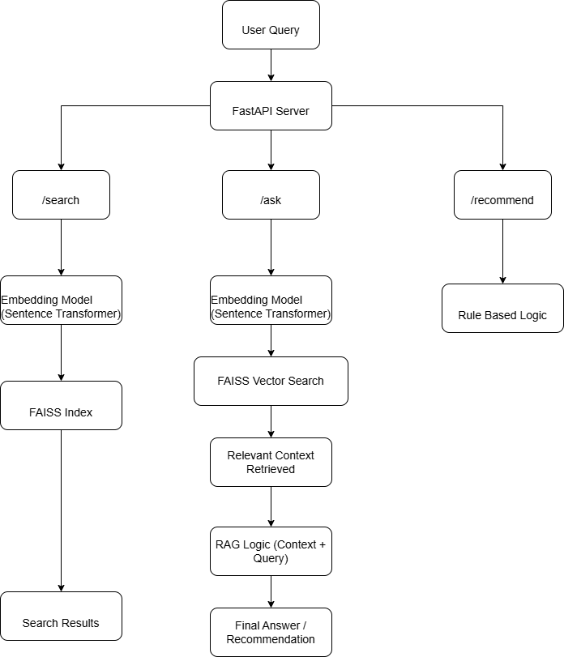

# Automotive AI Assistant 

## Overview
This project is a mini AI-powered automotive assistant that answers vehicle-related queries using:
- Semantic Search (FAISS)
- Retrieval-Augmented Generation (RAG)
- Rule-based Recommendation System

It supports queries about:
- Vehicle specifications
- Service schedules
- Owner manual information
- Basic troubleshooting

---

## Features

### Semantic Search
- Uses sentence embeddings (`all-MiniLM-L6-v2`)
- FAISS vector database for fast retrieval
- Cosine similarity for matching queries

### RAG-Based Assistant
- Retrieves relevant context from dataset
- Generates grounded answers
- Avoids hallucination by restricting to dataset

### Recommendation System
- Suggests vehicles based on user needs
- Example:
  - "towing" → Ford F-150 / Ranger
  - "performance" → Ford Mustang

---

## Dataset

Includes 3 Ford models:
- Ford F-150 (Truck)
- Ford Mustang (Coupe)
- Ford Ranger (Truck)

Each includes:
- Engine specs
- Transmission
- Fuel type
- Features
- Safety features
- Service schedule

Also includes:
- Owner manual data (warning lights, maintenance tips)

---

## Tech Stack

- Python
- FastAPI
- FAISS
- Sentence Transformers

---

## Architecture



---

## API Endpoints

### /search
Semantic search for vehicle knowledge

Example:
/search?query=Which truck is good for towing?


---

### /ask
RAG-based answer generation

Example:
/ask?query=What does engine warning light mean?


---

### /recommend
Vehicle recommendation

Example:
/recommend?query=I want a towing vehicle

---

## Key Concepts

### Embeddings
Text is converted into vector representations using Sentence Transformers.

### Cosine Similarity
Used to measure similarity between query and stored vectors. Higher similarity means closer meaning.

### What is RAG?
Retrieval-Augmented Generation (RAG) combines:
- Retrieval: fetching relevant data from FAISS
- Generation: producing answers using retrieved context

### Why Grounding is Important
In automotive systems, incorrect information can be dangerous. Grounding ensures answers are based only on verified data.

### Hallucination in AI
Hallucination occurs when the model generates incorrect or made-up information.

### Mitigation Strategy
- Answers restricted to retrieved context
- If no relevant data → "I don't know"
- No external assumptions

## How to Run

### Local Setup
```bash
pip install -r requirements.txt
uvicorn main:app --reload

open:
http://127.0.0.1:8000/docs
```

### Docker Setup
```bash
docker build -t automotive-ai .
docker run -p 8000:8000 automotive-ai
```